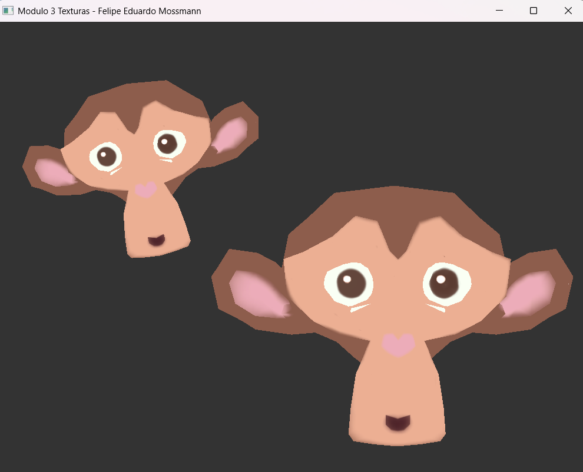
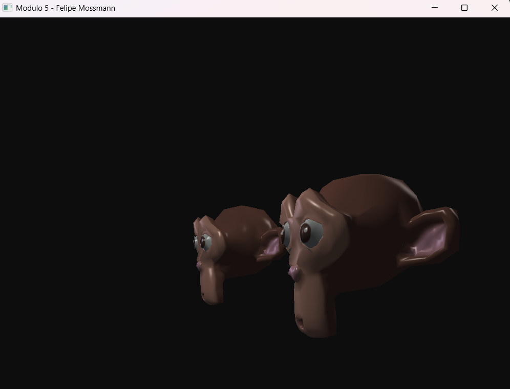
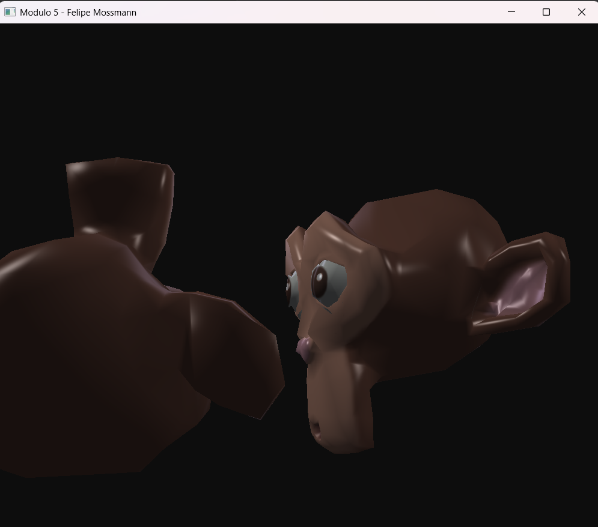
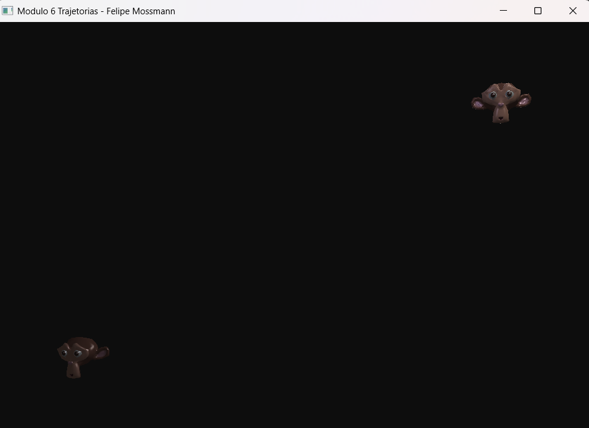
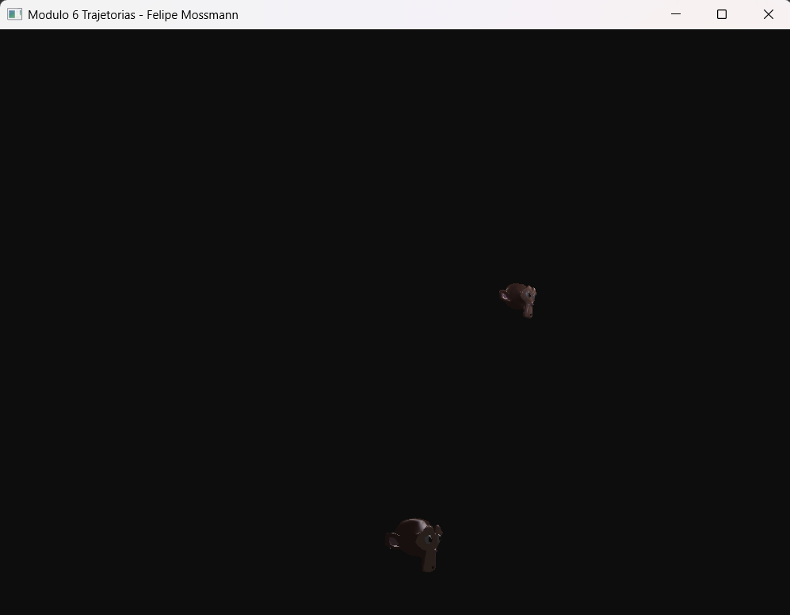

Resultado das atividades dos módulos

Módulo 1:

Módulo 2: 

Módulo 3:

Módulo 4 está na atividade vivencial 1

Módulo 5:
## Novas Funcionalidades: Câmera e Navegação (Primeira Pessoa)
* `Mouse`: Olhar ao redor (Visão 360º).
* `W`: Mover para frente.
* `S`: Mover para trás.
* `A`: Mover para a esquerda.
* `D`: Mover para a direita.
* `Scroll do Mouse`: Ajustar Zoom (Aproximar/Afastar).

Módulo 6:
## Novas Funcionalidades: Trajetória Animada
* `P`: Adiciona um waypoint na posição exata atual da câmera para o objeto selecionado.
* `ESPAÇO`: Inicia ou Pausa a animação de trajetória do objeto selecionado (exige pelo menos 2 pontos criados).
* `O`: (Letra O) Apaga todos os pontos gravados e reseta a trajetória do objeto selecionado.

