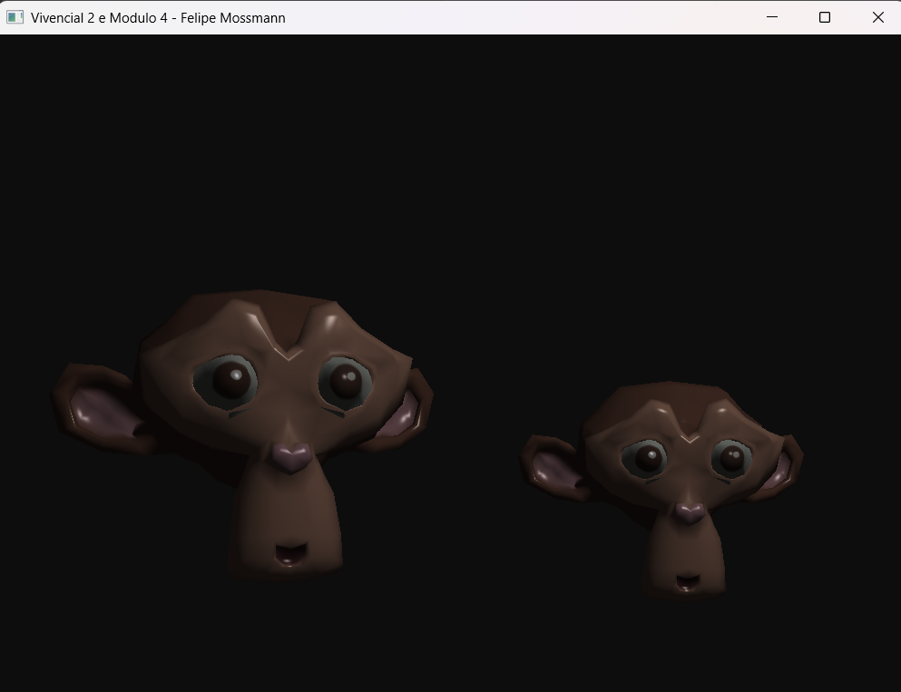
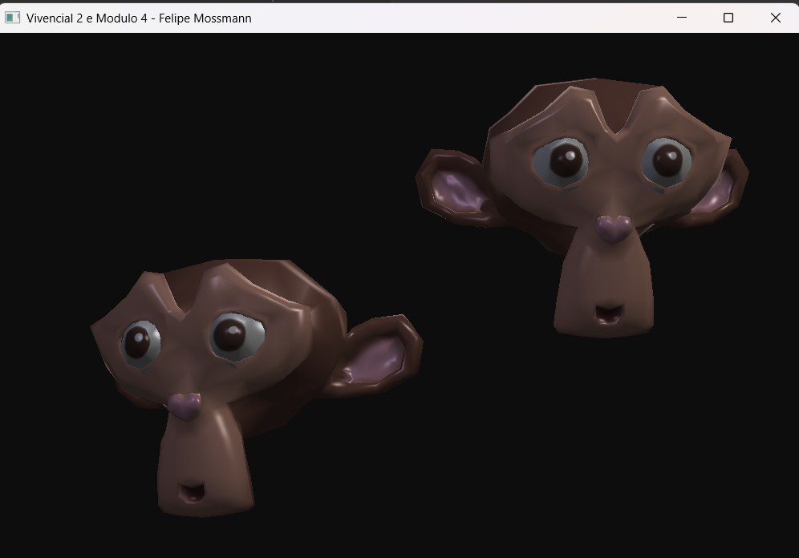

Tarefa Vivencial 1:

Felipe Eduardo Mossmann

Comandos: 

**Seleção de Objetos**
* `TAB`: Alterna a seleção para o próximo objeto da cena. O primeiro objeto inicia selecionado.

**Transladar (T)**
* `W` / `S`: Move o objeto no eixo **Y** (Cima / Baixo).
* `A` / `D`: Move o objeto no eixo **X** (Esquerda / Direita).
* `Q` / `E`: Move o objeto no eixo **Z** (Frente / Trás).

**Rotacionar (R)**
* `Seta para Cima` / `Seta para Baixo`: Rotaciona o objeto no eixo **X**.
* `Seta para a Esquerda` / `Seta para a Direita`: Rotaciona o objeto no eixo **Y**.
* `Z` / `C`: Rotaciona o objeto no eixo **Z**.

**Aplicar Escala (S)**
* `]` (Colchete Direito): Aumenta a escala do objeto em todos os eixos simultaneamente.
* `[` (Colchete Esquerdo): Diminui a escala do objeto em todos os eixos simultaneamente.

**Outros Comandos**
* `ESC`: Encerra a aplicação.

# Tarefa Vivencial 2: Iluminação de 3 Pontos

Felipe Eduardo Mossmann

Comandos: 

**Controle de Iluminação (Estúdio 3 Pontos)**
* `1`: Liga/Desliga a **Luz Principal (Key Light)** - Luz direcional primária e mais forte.
* `2`: Liga/Desliga a **Luz de Preenchimento (Fill Light)** - Luz de intensidade média para suavizar as sombras (tom azulado).
* `3`: Liga/Desliga a **Luz de Fundo (Back Light)** - Luz traseira para destacar o contorno do objeto.

**Seleção de Objetos**
* `TAB`: Alterna a seleção para o próximo objeto da cena (Macaco 1 ou Macaco 2). O foco das luzes sempre acompanha o objeto selecionado.

**Transladar (T)**
* `W` / `S`: Move o objeto no eixo **Y** (Cima / Baixo).
* `A` / `D`: Move o objeto no eixo **X** (Esquerda / Direita).
* `Q` / `E`: Move o objeto no eixo **Z** (Frente / Trás).

**Rotacionar (R)**
* `Seta para Cima` / `Seta para Baixo`: Rotaciona o objeto no eixo **X**.
* `Seta para a Esquerda` / `Seta para a Direita`: Rotaciona o objeto no eixo **Y**.
* `Z` / `C`: Rotaciona o objeto no eixo **Z**.

**Aplicar Escala (S)**
* `]` (Colchete Direito): Aumenta a escala do objeto em todos os eixos simultaneamente.
* `[` (Colchete Esquerdo): Diminui a escala do objeto em todos os eixos simultaneamente.

**Outros Comandos**
* `ESC`: Encerra a aplicação.